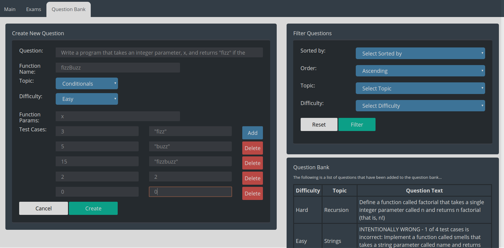
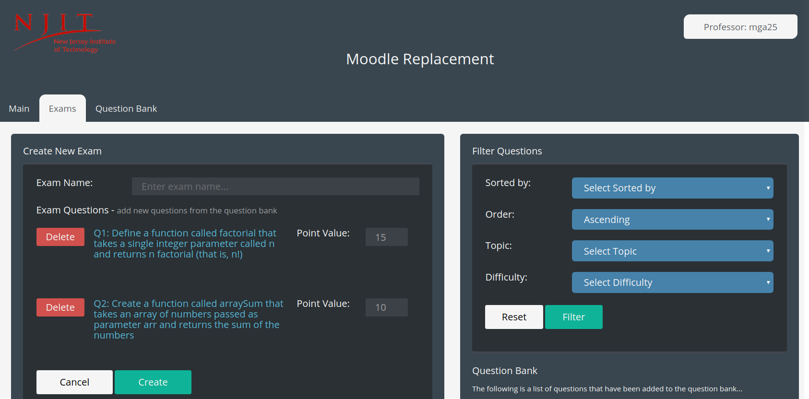
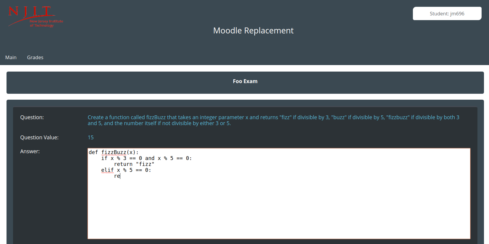
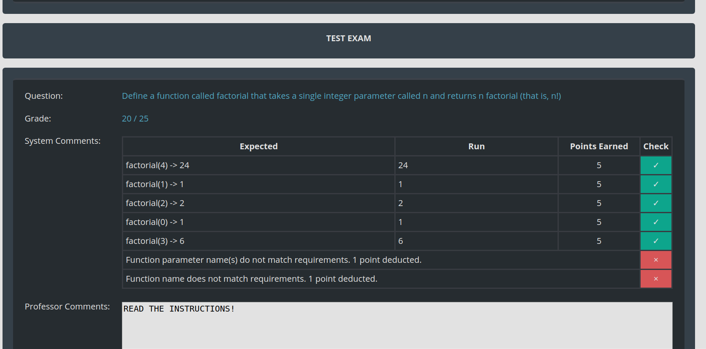
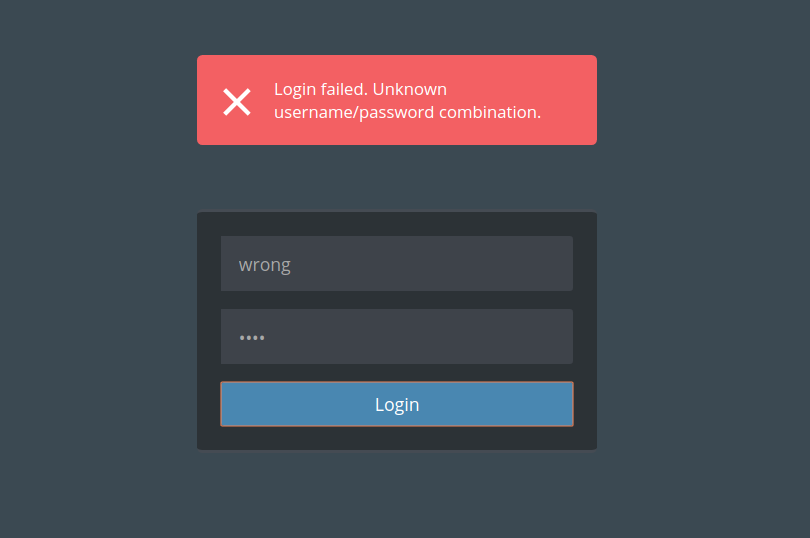

# CS 490 Learning Management System

 - Learning management system tailored to CS courses, implemented as a three-tier web
   application
   - HTML/CSS/JS
   - PHP
   - MySQL
   - Requirements of course prohibited use of frameworks/libraries (**no** Bootstrap, JQuery, Angular, Laravel, etc.)
  - Allows professors to maintain a question bank of programming exercises and to create tests consisting of interactive programming exercises
  - Includes a component that automatically grades students' answers to programming exercises, with provisions for partial credit based on test cases passed
  - [Watch the demonstration on YouTube](https://youtu.be/qNahJ7HPGjk)

__Managing the question bank__

__Creating an exam__

__Taking a test__

__Viewing autograde results__

__Stored passwords are hashed and salted__

As presented on Tuesday, December 12, 2017
